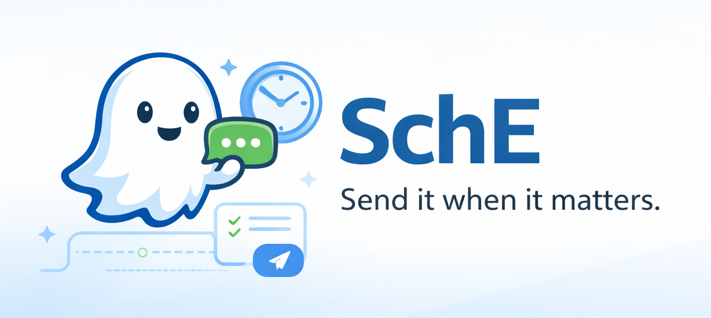

<p align="center">
  
</p>

**SchE (Schedule Engine)** is a lightweight Windows assistant that helps users **schedule messages across chat applications** like WhatsApp Web and Microsoft Teams.

It works like a tiny productivity companion that quietly watches when you type in supported chat apps and offers a quick option to **schedule the message for later delivery**.

Think of it as **Grammarly for message timing**.

---

## Problem

Most messaging platforms only allow **instant sending**.

Many real-life situations require sending messages **later**, such as:

* Birthday wishes
* Work reminders
* Follow-ups with clients
* Messages across time zones
* Professional communication timing

SchE solves this by enabling **universal message scheduling across chat applications**.

---

## How It Works

SchE monitors keyboard activity and detects when the user is typing inside supported chat apps.

When typing is detected, a small contextual popup appears asking whether the message should be scheduled.

If the user chooses to schedule it:

1. The message is captured from the input field
2. The message and scheduled time are stored locally
3. At the scheduled time SchE focuses the chat window
4. The message is inserted and automatically sent

---

## Features (MVP)

* Windows desktop assistant
* Detects typing activity in supported chat applications
* Grammarly-style popup for scheduling messages
* Captures typed messages automatically
* Stores scheduled messages locally
* Sends messages automatically at the scheduled time
* Simple dashboard to view scheduled messages

---

## Supported Apps (MVP)

* WhatsApp Web
* Microsoft Teams

More platforms can be added in future versions.

---

## System Architecture

```
SchE
│
├── Keyboard Monitor
├── Active Window Detector
├── Popup Engine
├── Message Capture Engine
├── Scheduler Engine
├── Delivery Engine
└── Dashboard UI
```

Workflow:

```
User typing
      ↓
Keyboard detection
      ↓
Active window check
      ↓
Popup appears
      ↓
User schedules message
      ↓
Message stored in SQLite
      ↓
Scheduler waits
      ↓
Delivery engine sends message
```

---

## Tech Stack

**Language**

* Python

**Libraries**

* keyboard
* pygetwindow
* pyautogui
* pyperclip
* sqlite3
* tkinter

---

## Project Structure

```
sche/
│
├── main.py
│
├── core/
│   ├── keyboard_monitor.py
│   ├── window_detector.py
│   ├── message_capture.py
│   ├── scheduler.py
│   ├── delivery_engine.py
│
├── ui/
│   ├── popup.py
│   ├── dashboard.py
│
├── db/
│   ├── database.py
│
├── utils/
│   ├── constants.py
│   ├── helpers.py
│
└── sche.db
```

---

## Database Schema

Table: `messages`

| Field         | Type     | Description            |
| ------------- | -------- | ---------------------- |
| id            | INTEGER  | Primary key            |
| app           | TEXT     | Target application     |
| window_title  | TEXT     | Chat window identifier |
| message       | TEXT     | Scheduled message      |
| schedule_time | DATETIME | Time to send message   |
| status        | TEXT     | pending / sent         |

Example record:

```
1
WhatsApp
WhatsApp - Chrome
Happy birthday bro!
2026-03-15 09:00
pending
```

---

## Installation

Clone the repository:

```
git clone https://github.com/yourusername/sche.git
cd sche
```

Install dependencies:

```
pip install keyboard pygetwindow pyautogui pyperclip
```

---

## Running SchE

Start the assistant:

```
python main.py
```

Once running, SchE will monitor supported chat applications and show the scheduling popup when typing is detected.

---

## Current Limitations (MVP)

* Chat window must remain open for automatic message delivery
* Clipboard may briefly be overwritten during message capture
* UI automation may break if chat applications change their interface
* Only Windows is supported in this version

---

## Future Improvements

* AI-based smart scheduling
* More supported apps (Slack, Discord, Instagram)
* Recipient detection
* Background service mode
* Cross-platform support (Mac / Linux)
* Chrome extension integration
* Cloud synchronization

---

## Vision

SchE aims to become a **universal communication scheduler** that works across messaging platforms, helping users manage conversations more efficiently.

Instead of remembering when to send messages, users can simply **write once and let SchE handle the timing**.